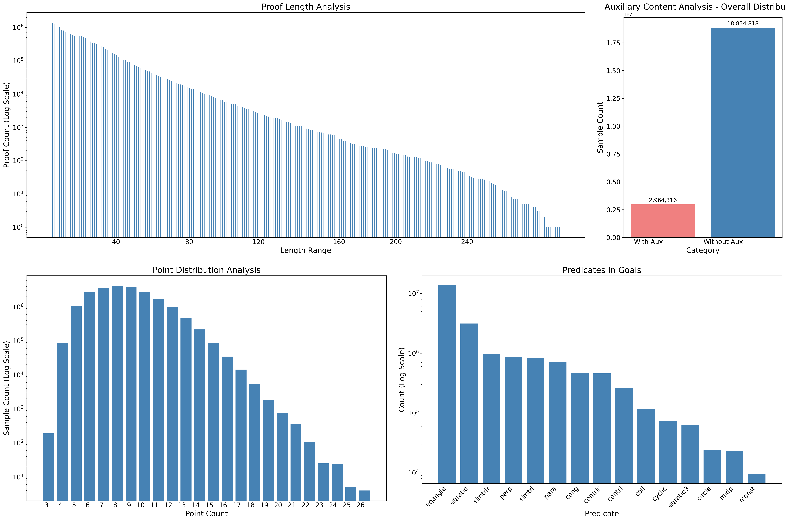
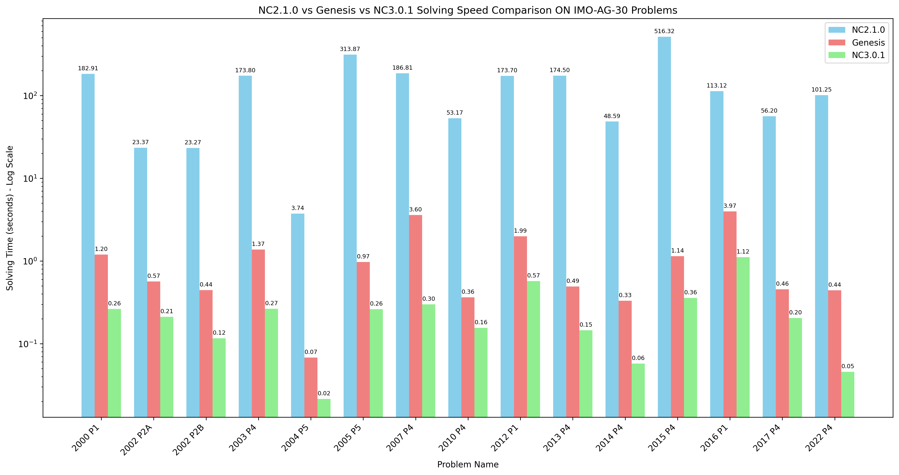
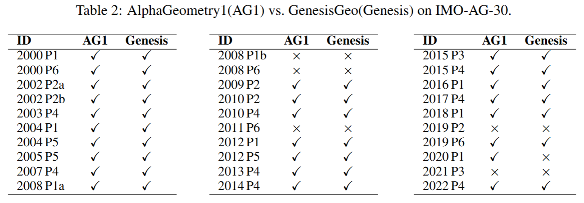

# GenesisGeo: Reproduction of AlphaGeometry

[📊 Dataset](https://huggingface.co/datasets/ZJUVAI/GenesisGeo) • [🤖 Model](https://huggingface.co/ZJUVAI/GenesisGeo)  • [📃Paper]()

We present **GenesisGeo**, a reproduction of [AlphaGeometry](https://www.nature.com/articles/s41586-023-06747-5). Based on the [Newclid](https://arxiv.org/abs/2411.11938) framework, we implement the **synthetic data generation** pipeline, accelerate DDARN by 120×, and instantiate a neuro-symbolic prover using a Qwen3-0.6B-Base model fine-tuned solely on our synthetic data as its language model. This prover **proves 24 of 30 theorems in the IMO-AG-30 benchmark**, closely approaching the 25 of 30 result reported by the original AG system and confirming the fidelity and efficacy of our reproduction.

---

## Dataset

We implemented AlphaGeometry’s synthetic data generation methodology. The generation procedure begins with the random sampling of geometric constructions. Using these constructions, a geometric figure is constructed. The symbolic engine then deduces all possible conclusions from this figure, which subsequently undergo a filtering process to remove low-quality results. For each conclusion that passes the filter, we employ the traceback method to obtain its complete proof process. By analyzing the dependency relations, we distinguish from the original premises, ultimately yielding a complete geometric problem that includes both the auxiliary constructions and the full proof.

Using 50 CPU threads over 22 hours, we generated a synthetic dataset of 21.8 million geometric problems, each with complete proof steps. More than 3 million of these problems involve auxiliary constructions in their proofs. 



## Enhanced DDARN

We significantly enhanced the efficiency of the DDARN engine by optimizing its theorem matching phase, which originally suffered from exponential time complexity due to combinatorial explosion of parameter combinations.

Focusing on predicates with numerous arguments—such as `eqangle` and `eqratio` (8 arguments each), and `simitri` and `simitrir` (6 arguments each)—we introduced a polynomial-time precomputation strategy. This approach pre-identifies numerically valid statements about angles, ratios, and triangle similarities, dramatically reducing the search space required for matching. Key steps include precomputing and caching all numerically equal angles and ratios for `eqangle` and `eqratio`, and efficiently deriving `simitri` and `simitrir` relations from existing `eqratio` results. The core matching pipeline is implemented in C++ for high performance.

These optimizations collectively result in a **120× speedup** in DDARN’s inference time.


## Neuro-symbolic prover

We implement the neuro-symbolic prover described in AlphaGeometry, in which a neural language model proposes auxiliary points, while a symbolic deduction engine applies geometric rules to perform deductive inference. We use a model finetuned from Qwen3-0.6B-Base on our synthetic dataset as the language model and our enhanced version of DDARN as the symbolic deduction engine.

Additionally, we incorporate a parallel beam search procedure where, at each iteration, the language model suggests multiple candidate auxiliary constructions. We retain the top-scoring proposals and proceed with the neuro-symbolic search loop until the proof is completed. To further enhance efficiency, we leverage `ray` to achieve asynchronous execution between symbolic engine reasoning and language model inference.

## Performance on IMO-AG-30

We evaluate GenesisGeo on the IMO-AG-30 benchmark, originally introduced in the AlphaGeometry study, which comprises 30 challenging geometry problems from the International Mathematical Olympiad. Our neuro-symbolic prover utilizes a Qwen3-0.6B-Base model fine-tuned exclusively on our synthetic data.

GenesisGeo proves 24 of the 30 theorems, closely matching the original AlphaGeometry's result of 25. This high level of performance demonstrates the effectiveness of our reproduction pipeline and the viability of synthetic data for training geometric reasoning models.



---

## Installation

```bash
git clone https://github.com/ZJUVAI/GenesisGeo.git
cd GenesisGeo
pip install -e .
```

**Compile Python extensions**

```bash
cd src/newclid
c++ -O3 -Wall -shared -std=c++14 -march=native -funroll-loops -flto `python3 -m pybind11 --includes` matchinC.cpp -o matchinC`python3-config --extension-suffix` -fPIC
cd dependencies
c++ -O3 -Wall -shared -std=c++14 -march=native -funroll-loops -flto `python3 -m pybind11 --includes` geometry.cpp -o geometry`python3-config --extension-suffix` -fPIC
```

## Data Generation

To generate a synthetic dataset:

```bash
cd src/newclid/generation
python generate.py --n_clauses=20 --n_threads=30 --n_samples=5000000 --log_level=info --timeout=7200
```

This command generates 5 million samples using 30 threads, with each problem having a timeout of 7200 seconds for DDAR. The generated data will be saved in the `src/newclid/generation/datasets/` directory.

## Model Training and Evaluation

We use the [ms-swift](https://github.com/modelscope/ms-swift) efficient training framework to fine-tune our language model. The complete process consists of two main stages: supervised fine-tuning (SFT) and comprehensive evaluation.

### Training and Evaluation Script

The entire pipeline is orchestrated by the `scripts/train_eval.sh` script, which performs the following steps:

1. **Supervised Fine-tuning (SFT)**:
   - Base model: Qwen/Qwen3-0.6B-Base
   - Dataset: Synthetic geometry problems with complete proof steps
   - Training configuration:
     - Full parameter fine-tuning
     - 8x GPUs
     - Maximum sequence length: 2048 tokens
     - Batch size: 8 per device
     - Learning rate: 1e-4 with warmup ratio of 0.1
     - Flash attention and Liger kernel optimizations enabled
     - Single epoch training

2. **Comprehensive Evaluation**:
   - Evaluates on multiple benchmarks (dev_jgex.txt, dev_imo.txt)
   - Uses beam search with configurable parameters (decoding_size, beam_size)
   - Parallel execution with 40 workers
   - Depth-limited search (depth=4) for proof discovery

To run the complete training and evaluation pipeline:

```bash
bash scripts/train_eval.sh
```

Note: Before running the evaluation, you need to modify the `checkpoints` array in the script to include the actual checkpoint directories (e.g., "checkpoint-10000"). The training part will run automatically, and after training is complete, the script will evaluate the model on the specified datasets with different decoding configurations.

### Run Evaluation with Our Open-Source Models

```bash
# single model
python scripts/evaluation.py --problems_path problems_datasets/imo_ag_
30.txt --model_path ZJUVAI/GenesisGeo --max_workers 80 --decoding_size 32 --beam_size 512 --search_depth 4 

# ensemble of two models
python scripts/evaluation.py --problems_path problems_datasets/imo_ag_
30.txt --model_path ZJUVAI/GenesisGeo-250915a ZJUVAI/GenesisGeo-250915b  --max_workers 80 --decoding_size 32 --beam_size 512 --search_depth 4
```

---

## Acknowledgements

- Thanks to the [AlphaGeometry](https://github.com/google-deepmind/alphageometry) team for their pioneering work.
- Built upon the [Newclid](https://github.com/xxx/newclid) framework.
- Uses [Qwen3](https://github.com/QwenLM/Qwen3) as the base language model.
- Model training is supported by the [ms-swift](https://github.com/modelscope/ms-swift) efficient training framework.
## Institution

Zhejiang University

## Citation

TO BE DONE
